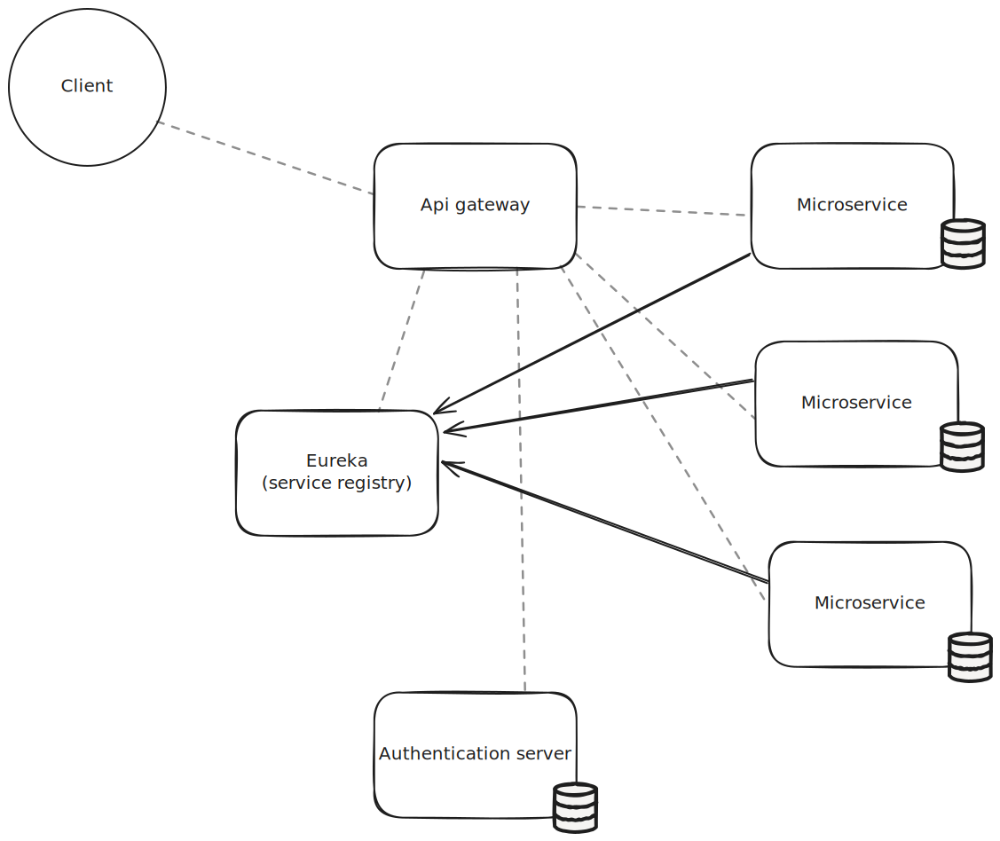

# Java microservice demo

This repo is an example of a microservice implementation. The application consists of 4 parts, api gateway, service registry, authentication server and the microservices. This project is written primarily in Java with Spring framework. Each component is containerized using Docker and finally each container is managed by Kubernetes.

